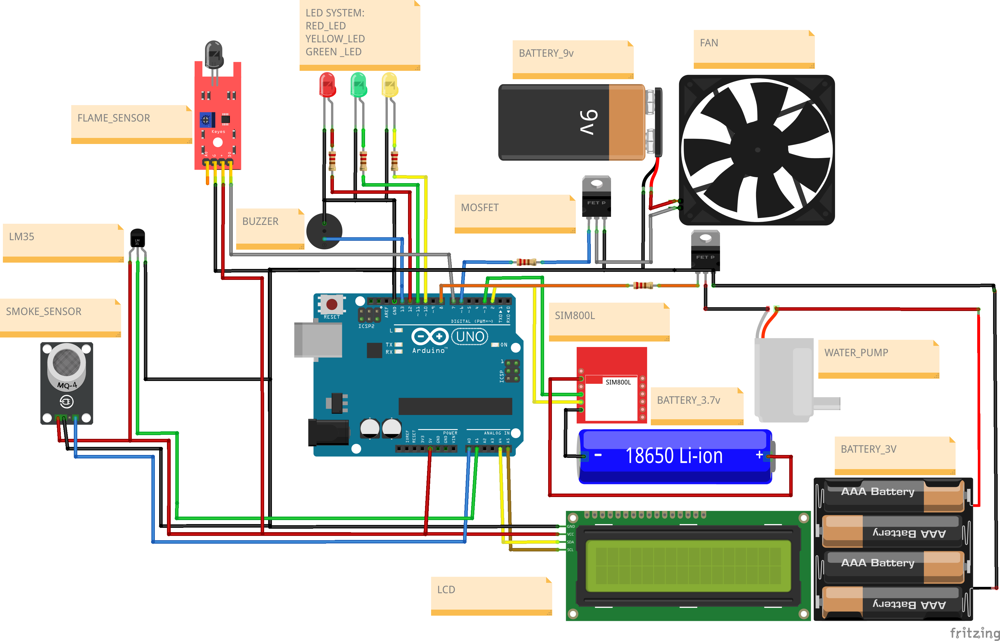

# 🔥 Fire and Smoke Detection System (Arduino Based)

This project is a fire and smoke detection system using Arduino. It's designed to detect fire, smoke, and high temperatures, and take automatic actions such as activating a fan, water pump, buzzer, and sending SMS/calls via SIM800L. It also displays readings on an LCD I2C.

## 📌 Features

- 🔥 Fire detection
- 🌫️ Smoke detection
- 🌡️ Temperature monitoring
- 💨 Fan control (multiple speeds)
- 🚨 Buzzer alert
- 💡 RGB LED indicators (Red, Yellow, Green)
- 💦 Water pump activation
- 📲 SMS and call alerts via SIM800L module
- 📟 Real-time data on LCD I2C display

## 🔧 Components Used

- Arduino Uno
- Half Breadboard
- Fire sensor
- Smoke sensor (MQ-2 or MQ-135)
- Temperature sensor (LM35)
- Fan (with speed control)
- Buzzer
- RGB LEDs (Red, Yellow, Green)
- LCD I2C display
- SIM800L GSM module
- Water pump
- Power supply

## 📈 Flowchart

We designed a complete flowchart to visualize the system’s behavior. You can find it in the `/flowchart/` folder.

## 🛠️ How It Works

1. Sensors detect fire, smoke, or high temperature.
2. Based on conditions, the system:
   - Activates fan with appropriate speed.
   - Triggers RGB LEDs (Red for danger, Yellow for warning, Green for safe).
   - Sounds a buzzer for alerts.
   - Turns on water pump if needed.
   - Sends an SMS or makes a call using SIM800L.

## 🧠 Project Leadership

- 👨‍💻 **Team Leader**: Fadi Sobhy Nashed  
- 👥 **Team Members**: 
  - Fadi Sobhy
  - Mario Answer
  - Lojain Ehab
  - Saif Mohamed
  - Youssef Refaat
  - Kerya Emad
  - Mahmoud Alaa

## 🚀 Getting Started

1. Upload the Arduino code using the Arduino IDE.
2. Connect all components as per the schematic.
3. Power on the system and observe sensor readings on the LCD.
4. Simulate fire/smoke to test the system.

## 📷 Diagram

---
